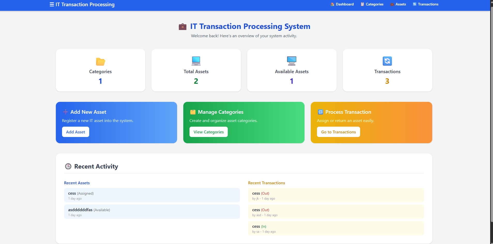

# 💻 IT Transaction Processing System

A web-based system for managing and tracking IT assets efficiently.

## 📘 Description / Overview

The IT Transaction Processing System is a web-based application designed to manage and monitor IT assets within an organization.

It allows users to:
- Add and categorize assets
- Process transactions (assignment or return)
- View dashboards and reports

## 🎯 Objectives

- Create an efficient system for managing IT assets
- Automate tracking of IT asset transactions (in/out)
- Develop CRUD functionalities (Create, Read, Update, Delete)
- Enhance understanding of database-driven web applications using modern technologies

## ⚙️ Features / Functionality

| Feature | Description |
|---------|-------------|
| 🗂️ Category Management | Create and organize asset categories |
| 📦 Asset Management | Add, edit, delete, and view assets |
| 🔄 Transaction Processing | Log assignments and returns of IT assets |
| 📊 Dashboard Overview | View total assets, categories, and transactions |
| 🕒 Recent Activity | See the latest updates and activities |

## 🧩 Installation Instructions

Follow these steps to set up the project locally:

```bash
# 1️⃣ Clone or download this repository
git clone https://github.com/princesskmyng/github.git

# 2️⃣ Navigate to the project folder
cd github

# 3️⃣ Open in your editor or browser (example using VS Code)
code .

# 4️⃣ Run using XAMPP or Live Server
```

💡 **Note:** Ensure your local server (like XAMPP) is running before launching the project.

## 🚀 Usage Guide

Follow these instructions to use the IT Transaction Processing System:

1. **Open your web browser** and go to:
   ```
   http://localhost/your_project_folder
   ```

2. **Navigate the system** using the menu options:
   - **Dashboard:** View overall system statistics such as total assets, categories, and recent transactions
   - **Assets:** Add, edit, delete, and view IT assets
   - **Categories:** Organize asset types for easier management
   - **Transactions:** Log the assignment or return of IT assets

3. **Perform actions on data:**
   - Click the "Add" button to create new records
   - Click "Edit" to update existing records
   - Click "Delete" to remove records permanently

4. **Monitor recent activity** from the Dashboard or Transactions page to stay updated on system changes

💡 **Tip:** Regularly update asset categories and transactions to keep reports accurate.

## 🖼️ Screenshots or Code Snippets

### 📊 Dashboard Example



The dashboard provides:
- **Overview Cards:** Display total categories, assets, available assets, and transactions
- **Quick Actions:** Add new assets, manage categories, or process transactions
- **Recent Activity:** View recent assets and transactions at a glance

### 💻 Sample Code Snippet

```html
<!-- Example of a dashboard card -->
<div class="card">
  <h3>Total Assets</h3>
  <p>120</p>
</div>
```

## 👩‍💻 Contributors

- **Princess Kimayong**

📧 **Contact:** cessj86@gmail.com

## 🪪 License

**MIT License**

Copyright (c) 2025 Princess Kimayong

Permission is hereby granted, free of charge, to any person obtaining a copy of this software and associated documentation files (the "Software"), to deal in the Software without restriction, including without limitation the rights to use, copy, modify, merge, publish, distribute, sublicense, and/or sell copies of the Software, and to permit persons to whom the Software is furnished to do so, subject to the following conditions:

The above copyright notice and this permission notice shall be included in all copies or substantial portions of the Software.

THE SOFTWARE IS PROVIDED "AS IS", WITHOUT WARRANTY OF ANY KIND, EXPRESS OR IMPLIED, INCLUDING BUT NOT LIMITED TO THE WARRANTIES OF MERCHANTABILITY, FITNESS FOR A PARTICULAR PURPOSE AND NONINFRINGEMENT. IN NO EVENT SHALL THE AUTHORS OR COPYRIGHT HOLDERS BE LIABLE FOR ANY CLAIM, DAMAGES OR OTHER LIABILITY, WHETHER IN AN ACTION OF CONTRACT, TORT OR OTHERWISE, ARISING FROM, OUT OF OR IN CONNECTION WITH THE SOFTWARE OR THE USE OR OTHER DEALINGS IN THE SOFTWARE.
